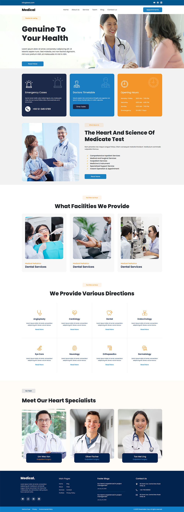

# Medical Home Page 🚀

Welcome to the **Medical Home Page**, a modern and fully responsive home page for a dummy medical website. This project is a PSD to React conversion designed using **React, Bootstrap, and Vite**.

Check it out live 👉 **[Medical Home Page](https://medical-home-page.netlify.app/)**

---

## ✨ Features

- 🚀 **Component-Based Architecture** – Every section is modular and reusable.
- 📱 **Fully Responsive** – Adapts seamlessly to different screen sizes.
- 🎨 **Bootstrap Styling** – Quick and elegant design with Bootstrap 5.
- ⚡ **Developed with Vite** – Fast and optimized development experience.
- 🌍 **Hosted on Netlify** – Live preview available anytime!

---

## 🛠 Tech Stack

- **React 19**
- **Bootstrap 5**
- **Vite** (for development and build)
- **ESLint** (for linting and clean code)

---

## 📸 Screenshot



---

## 🚀 Getting Started

Want to check it out locally? Follow these steps:

### 📋 Requirements

- **Node.js** (v16 or later)
- **npm** (or yarn)

### ⏳ Installation

1. **Clone this repository**
   ```sh
   git clone https://github.com/your-username/medical-landing-page.git
   cd medical-landing-page
   ```
2. **Install dependencies**
   ```sh
   npm install
   ```
3. **Run the development server**
   ```sh
   npm run dev
   ```
4. Open your browser and go to `http://localhost:5173/` (or the provided URL).

### 📦 Build for Production

To create an optimized production build:

```sh
npm run build
```

To preview the production build locally:

```sh
npm run preview
```

---

## 🎨 About the Author

Created with ❤️ by **[Md Asifullah](https://www.artisanasif.com/)**, a passionate developer.

Want to connect? Let's talk! 🚀

---

## 📜 License

This project is for learning purposes only. Feel free to fork and experiment!

**Happy Coding! 🎉**
